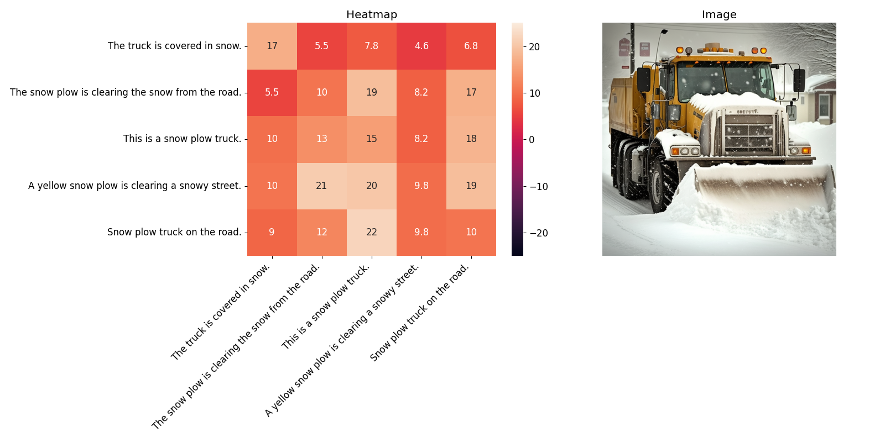
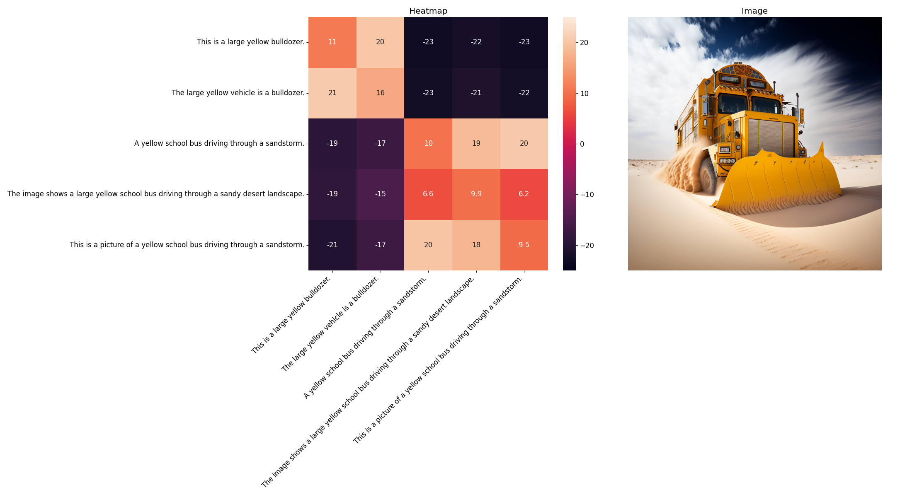

# Don't Fight Hallucinations, Use Them: Estimating Image Realism using NLI over Atomic Facts

This repository contains resources for the paper *"Don't Fight Hallucinations, Use Them: Estimating Image Realism using NLI over Atomic Facts."*

## Files Overview

### Data & Notebooks

1. **atomic_facts.jsonl**  
   A collection of generated atomic facts about images from the WHOOPS! dataset sampled using **Diverse Beam Search** from the [LLaVA-v1.6-Mistral-7B](https://huggingface.co/llava-hf/llava-v1.6-mistral-7b-hf) model.

2. **notebooks/nli_agg.ipynb**  
   A Jupyter Notebook implementing **Natural Language Inference (NLI)** scoring with clustering aggregation scheme. It reproduces the main results for classification on the WHOOPS! dataset.

### Scripts

Scripts should be run using Python’s module system: `python -m scripts.script_name`

3. **scripts/generate_facts.py**  
   Generates atomic facts for images following the fact generation protocol described in the paper.

4. **scripts/predict.py**  
   Uses the generated atomic facts to predict image realism.

### Model Utilities

5. **model/utils.py**  
   Implements the computation of the **Reality Score** by calculating NLI-scores between atomic facts and aggregating them into a single score.

---

## Method Illustration

Our method identifies contradictions between generated atomic facts to estimate image realism.

### Example 1: Normal Image

### Example 2: Weird Image

